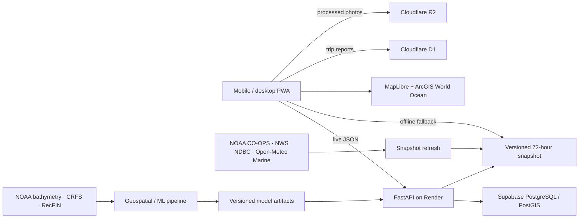

# CastingCompass

Live app: [castingcompass.com](https://castingcompass.com) · Source:
[github.com/brianbzeng/castingcompass](https://github.com/brianbzeng/castingcompass)

Owner launch tracking: [goal-status dashboard](docs/GOAL_STATUS.md) · Detailed acceptance
criteria: [product roadmap](docs/PRODUCT_ROADMAP.md)

Security boundaries: [threat model and 13-layer security map](docs/THREAT_MODEL.md) ·
[access-control matrix](docs/ACCESS_CONTROL_MATRIX.md) ·
[key custody and encryption](docs/KEY-CUSTODY-AND-ENCRYPTION.md)

CastingCompass is an installable, mobile-first California halibut opportunity planner for public shore, beach, jetty, and pier access from Point Reyes through San Francisco Bay to Half Moon Bay.

It compares reachable casting zones and two-hour windows using three separately visible components:

- **Habitat** — long-term seafloor structure and public recreational catch evidence.
- **Seasonality** — monthly California halibut catch and effort patterns.
- **Conditions** — a bounded modifier from tide, wind, swell, current, and daylight. Modeled water temperature is shown as context but is not scored until it is validated against local observations.

The final 0–100 **Opportunity Score is a relative percentile**, not a catch probability. A score of 80 means a site/window ranks above 80% of the candidates in the current evaluation set.

## Current demo status

The checked-in demo includes:

- 47 curated public access locations, with temporary closures retained in the catalog but excluded from ranking.
- 1,656 two-hour windows over a 72-hour horizon when one catalog location is closed.
- Live public NOAA CO-OPS tide predictions, NWS hourly forecasts, NDBC observations, and Open-Meteo Marine modeled SST at snapshot generation time.
- Visible freshness states and exclusion of missing/stale inputs.
- A MapLibre map using ArcGIS World Ocean base and reference layers, clustered map-native site points, a ranked access list, preset/custom distance-radius filtering, score explanations, official CDFW links, responsive detail sheets, geolocation sorting, PWA installation, and offline access to the latest loaded forecast.
- A first-party validation beta with start/end trip logging, complete catch and no-catch outcomes, searchable gear catalogs and reusable presets, pending-review submissions, aggregate ledger totals, optional metadata-stripped verification photos, and MiMo-sanitized anonymous location notes.
- FastAPI endpoints, PostgreSQL/PostGIS schema, Docker/Render configuration, and file-snapshot fallback.
- A reproducible geospatial/ML pipeline with terrain derivation, blocked validation, baselines, ablations, a six-channel ResNet-style encoder, SimCLR-style pretraining, and two-task fine-tuning scaffolding.

The live snapshot's habitat score and monthly seasonality are explicitly labeled **demo/provisional proxies**. No trained deep model contributes to the live score and no real-world performance claim is shipped yet. The repository contains the six-channel ResNet/SimCLR research pipeline and two prediction heads; that model can replace the habitat proxy only after official-data training and geographically blocked validation. See the [model card](docs/MODEL_CARD.md), [dataset card](docs/DATASET_CARD.md), [feasibility report](docs/FEASIBILITY_REPORT.md), and [community-integration policy](docs/COMMUNITY_INTEGRATIONS.md).

## Architecture



More detail: [docs/ARCHITECTURE.md](docs/ARCHITECTURE.md).

## Local development

Requirements:

- Node.js 22.13+
- Python 3.12+
- Docker, only if you want the local PostGIS stack

### PWA

```bash
npm install
npm run dev
```

Open `http://localhost:3000`.

The PWA uses `public/data/opportunities.json` when `NEXT_PUBLIC_API_URL` is unset. To use a running API, copy `.env.example` to `.env.local` and keep:

```bash
NEXT_PUBLIC_API_URL=http://localhost:8000
```

Trip-report APIs are served by the PWA Worker itself. Local and hosted builds use the logical `DB` D1 binding for structured reports and `TRIP_PHOTOS` R2 binding for processed WebP verification images. The checked-in migration is applied through the Sites deployment workflow.

### Refresh the 72-hour public-data snapshot

```bash
npm run data:refresh
```

The generator never substitutes invented ocean/weather values. Missing sources remain null and are marked excluded. Open-Meteo's public endpoint is non-commercial and requires attribution; switch to a commercial plan or another licensed provider before enabling subscriptions or ads.

### FastAPI

```bash
python3 -m venv .venv
source .venv/bin/activate
python -m pip install --only-binary=:all: --require-hashes -r services/api/requirements-test.lock
uvicorn services.api.app.main:app --reload --port 8000
```

Swagger is available at `http://localhost:8000/docs`.

Endpoints:

- `GET /health`
- `GET /v1/sites`
- `GET /v1/sites/{id}`
- `GET /v1/opportunities?species=california-halibut&from=&hours=72`

Run the API and local PostGIS together:

```bash
docker compose up --build
```

### Geospatial/ML smoke workflow

```bash
python3 -m venv .pipeline-venv
source .pipeline-venv/bin/activate
python -m pip install --only-binary=:all: --require-hashes -r pipeline/requirements-ci.lock
python3 -m unittest discover -s pipeline/tests -v
python3 -m pipeline.contourcast.cli smoke --output-dir /tmp/contourcast-smoke --seed 42
```

The smoke dataset is synthetic and only checks pipeline plumbing. It is never presented as fishing evidence. Full GeoTIFF/PyTorch execution uses a reviewed platform lock: `pipeline/requirements-geo-deep-macos-arm64.lock` for macOS ARM64/MPS or `pipeline/requirements-geo-deep-linux-cpu.lock` for Linux x86-64 CPU. CUDA, ROCm, Windows, and other unlisted environments are not approved as reproducible research stacks.

## Verification

```bash
npm test
npm run lint
python3 -m pytest services/api/tests -q
python3 -m unittest discover -s pipeline/tests -v
```

## Deployment

## Account and trip data operations

Production account, saved-location, and trip data lives in the Cloudflare D1 database named `contourcast-trips`. In the Cloudflare dashboard, open **Storage & databases → D1 SQL database → contourcast-trips → Console**. The main tables are:

- `users` — account identity and password hashes (never display or export password fields)
- `auth_sessions` — hashed, expiring session tokens
- `saved_sites` — account-owned saved fishing locations
- `trips` — active and completed trip logs, forecast context, moderation state, and advisory AI-review results
- `gear_profiles` — account-owned reusable rod, reel, lure/bait, and rig presets
- `site_discussion_posts` — bounded anonymous summaries produced from useful reviewed notes; raw notes and account identity are not exposed by the public endpoint
- `email_challenges` — short-lived signup and password-reset codes

Use narrow projections when inspecting production records. For example:

```bash
npx wrangler d1 execute contourcast-trips --remote --config wrangler.jsonc \
  --command "SELECT id, user_id, site_id, started_at, ended_at, halibut_encounters, no_catch, moderation_status FROM trips ORDER BY created_at DESC LIMIT 25;"
```

Email verification and password recovery use Resend. Verify a sending subdomain, then add `RESEND_API_KEY` as a Worker secret and set `AUTH_EMAIL_FROM` to a sender on that verified domain. New-account creation intentionally remains unavailable until the sender is connected; existing accounts can still sign in.

Optional MiMo review is advisory only. Add `MIMO_API_KEY` as a Worker secret to check a completed report for missing or internally inconsistent fields, normalize recognizable gear, and prepare a short anonymous location summary when a note is relevant and safe to publish. The review never approves, rejects, labels an angler as truthful or untruthful, or ranks one brand as more effective without sufficient aggregate evidence. It receives no account email or session data. Public discussion responses never include raw notes, account identity, photos, or exact coordinates.

The public forecast snapshot refreshes every three hours through `.github/workflows/refresh-snapshot.yml`. That cadence is appropriate for wind, swell, buoy, tide, and temperature inputs. Bathymetry is static survey data and should be refreshed only when a source survey or derived terrain model changes, not every day.

- **PWA:** Cloudflare or Sites-compatible vinext deployment.
- **API:** Render using `render.yaml`.
- **Database:** Supabase PostgreSQL with PostGIS; apply `infra/schema.sql`.
- **Static resilience:** the PWA retains the most recently loaded forecast and can fall back to the versioned snapshot.

Set the production PWA's `NEXT_PUBLIC_API_URL` to the Render service URL and the API's `ALLOWED_ORIGINS` to the final PWA origin. The optional Postgres service uses a bounded process pool (defaults: 1 warm, 4 maximum, 8 queued checkouts) and a 60-second public-site cache; size each deployed process against the database provider's total connection ceiling. Cloudflare D1 continues through its managed binding and does not use this pool. Never commit `DATABASE_URL` or service tokens.

For the production Worker, D1 trip storage, custom domain, release command, and
Cloudflare Git build settings, see [Cloudflare deployment](docs/CLOUDFLARE_DEPLOYMENT.md).
For structured request correlation, redaction rules, saved Cloudflare diagnostic views, alerts,
and the PostHog decision boundary, see [Observability and operator diagnostics](docs/OBSERVABILITY.md).

## Safety and interpretation

- CastingCompass is a planning aid, not a guarantee of catch.
- Bathymetry is explanatory context, not navigational data.
- Regulation links are informational; always check official CDFW rules and posted access closures.
- Current CDFW guidance lists a 22-inch total-length minimum for retained California halibut; the app repeats this as a reminder while linking back to the live regulation page.
- Only public access locations are ranked. Exact user catch locations are not collected in this version.
- Trip reports remain pending review and do not alter the Opportunity Score automatically. Public ledger values are aggregate submission totals, not verified catch claims; location discussions contain only bounded MiMo-sanitized summaries from useful notes.

## Official source entry points

- [NOAA San Francisco Bay bathymetry](https://www.ncei.noaa.gov/access/metadata/landing-page/bin/iso?id=gov.noaa.ngdc.mgg.dem%3Asan_francisco_bay_P090_2018)
- [CDFW CRFS spatial catch and effort](https://test.lab.data.ca.gov/dataset?name=california-recreational-fisheries-survey-catch-per-unit-angler-for-all-species-and-all-effort-r)
- [RecFIN](https://reports.psmfc.org/recfin/)
- [NOAA CO-OPS API](https://api.tidesandcurrents.noaa.gov/api/dev)
- [NWS API](https://www.weather.gov/documentation/services-web-api)
- [NOAA CoastWatch ERDDAP](https://coastwatch.noaa.gov/erddap/index.html)
- [Open-Meteo Marine API](https://open-meteo.com/en/docs/marine-weather-api)
- [ArcGIS World Ocean basemap](https://developers.arcgis.com/rest/basemap-styles/arcgis-oceans-base-webmap-get/)
- [CDFW San Francisco Bay regulations](https://wildlife.ca.gov/Fishing/Ocean/Regulations/Fishing-Map/sf-bay)
- [CDFW San Francisco coast regulations](https://wildlife.ca.gov/Fishing/Ocean/Regulations/Fishing-Map/San-Francisco)

## License

Application source is provided for portfolio and development use. Upstream datasets remain governed by their source agencies' terms, metadata, attribution, and redistribution requirements.
