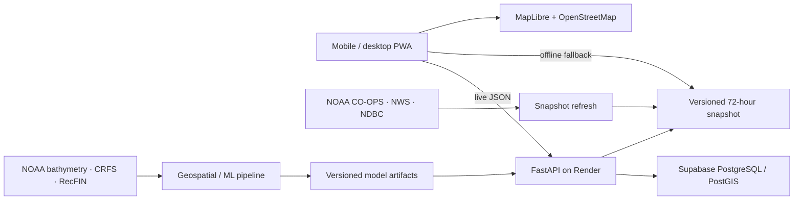

# ContourCast

ContourCast is an installable, mobile-first California halibut opportunity planner for public shore, beach, jetty, and pier access from Point Reyes through San Francisco Bay to Half Moon Bay.

It compares reachable casting zones and two-hour windows using three separately visible components:

- **Habitat** — long-term seafloor structure and public recreational catch evidence.
- **Seasonality** — monthly California halibut catch and effort patterns.
- **Conditions** — a bounded modifier from tide, wind, swell, water temperature, current, and daylight.

The final 0–100 **Opportunity Score is a relative percentile**, not a catch probability. A score of 80 means a site/window ranks above 80% of the candidates in the current evaluation set.

## Current demo status

The checked-in demo includes:

- 47 curated public access locations.
- 1,692 two-hour windows over a 72-hour horizon.
- Live public NOAA CO-OPS tide predictions, NWS hourly forecasts, and NDBC observations at snapshot generation time.
- Visible freshness states and exclusion of missing/stale inputs.
- A MapLibre map, ranked access list, score explanations, official CDFW links, responsive detail sheets, geolocation sorting, PWA installation, and offline access to the latest loaded forecast.
- FastAPI endpoints, PostgreSQL/PostGIS schema, Docker/Render configuration, and file-snapshot fallback.
- A reproducible geospatial/ML pipeline with terrain derivation, blocked validation, baselines, ablations, a six-channel ResNet-style encoder, SimCLR-style pretraining, and two-task fine-tuning scaffolding.

The live snapshot's habitat score and monthly seasonality are explicitly labeled **demo/provisional proxies**. No trained deep model or real-world performance claim is shipped yet. See the [model card](docs/MODEL_CARD.md), [dataset card](docs/DATASET_CARD.md), and [feasibility report](docs/FEASIBILITY_REPORT.md).

## Architecture



More detail: [docs/ARCHITECTURE.md](docs/ARCHITECTURE.md).

## Local development

Requirements:

- Node.js 22.13+
- Python 3.12+
- Docker, only if you want the local PostGIS stack

### PWA

```bash
npm install
npm run dev
```

Open `http://localhost:3000`.

The PWA uses `public/data/opportunities.json` when `NEXT_PUBLIC_API_URL` is unset. To use a running API, copy `.env.example` to `.env.local` and keep:

```bash
NEXT_PUBLIC_API_URL=http://localhost:8000
```

### Refresh the 72-hour public-data snapshot

```bash
npm run data:refresh
```

The generator never substitutes invented ocean/weather values. Missing sources remain null and are marked excluded.

### FastAPI

```bash
python3 -m venv .venv
source .venv/bin/activate
pip install -r services/api/requirements.txt
uvicorn services.api.app.main:app --reload --port 8000
```

Swagger is available at `http://localhost:8000/docs`.

Endpoints:

- `GET /health`
- `GET /v1/sites`
- `GET /v1/sites/{id}`
- `GET /v1/opportunities?species=california-halibut&from=&hours=72`

Run the API and local PostGIS together:

```bash
docker compose up --build
```

### Geospatial/ML smoke workflow

```bash
python3 -m venv .pipeline-venv
source .pipeline-venv/bin/activate
pip install -r pipeline/requirements-smoke.txt
python3 -m unittest discover -s pipeline/tests -v
python3 -m pipeline.contourcast.cli smoke --output-dir /tmp/contourcast-smoke --seed 42
```

The smoke dataset is synthetic and only checks pipeline plumbing. It is never presented as fishing evidence. Full GeoTIFF/PyTorch execution uses the optional dependencies in `pipeline/requirements-geo-deep.txt`.

## Verification

```bash
npm test
npm run lint
python3 -m pytest services/api/tests -q
python3 -m unittest discover -s pipeline/tests -v
```

## Deployment

- **PWA:** Cloudflare or Sites-compatible vinext deployment.
- **API:** Render using `render.yaml`.
- **Database:** Supabase PostgreSQL with PostGIS; apply `infra/schema.sql`.
- **Static resilience:** the PWA retains the most recently loaded forecast and can fall back to the versioned snapshot.

Set the production PWA's `NEXT_PUBLIC_API_URL` to the Render service URL and the API's `ALLOWED_ORIGINS` to the final PWA origin. Never commit `DATABASE_URL` or service tokens.

## Safety and interpretation

- ContourCast is a planning aid, not a guarantee of catch.
- Bathymetry is explanatory context, not navigational data.
- Regulation links are informational; always check official CDFW rules and posted access closures.
- Only public access locations are ranked. Exact user catch locations are not collected in this version.

## Official source entry points

- [NOAA San Francisco Bay bathymetry](https://www.ncei.noaa.gov/access/metadata/landing-page/bin/iso?id=gov.noaa.ngdc.mgg.dem%3Asan_francisco_bay_P090_2018)
- [CDFW CRFS spatial catch and effort](https://test.lab.data.ca.gov/dataset?name=california-recreational-fisheries-survey-catch-per-unit-angler-for-all-species-and-all-effort-r)
- [RecFIN](https://reports.psmfc.org/recfin/)
- [NOAA CO-OPS API](https://api.tidesandcurrents.noaa.gov/api/dev)
- [NWS API](https://www.weather.gov/documentation/services-web-api)
- [NOAA CoastWatch ERDDAP](https://coastwatch.noaa.gov/erddap/index.html)
- [CDFW San Francisco Bay regulations](https://wildlife.ca.gov/Fishing/Ocean/Regulations/Fishing-Map/sf-bay)
- [CDFW San Francisco coast regulations](https://wildlife.ca.gov/Fishing/Ocean/Regulations/Fishing-Map/San-Francisco)

## License

Application source is provided for portfolio and development use. Upstream datasets remain governed by their source agencies' terms, metadata, attribution, and redistribution requirements.
