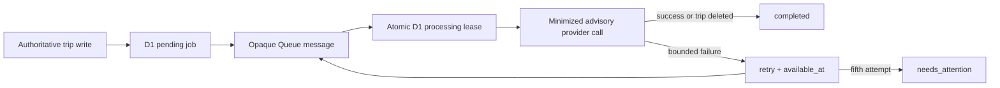

# Advisory AI review queue

Status: repository implementation complete; production/provider activation not authorized

The production configuration keeps `AI_REVIEW_QUEUE_ENABLED=false` and contains no Queue
binding. Until a separately reviewed provider change completes every activation gate below,
trip review continues through the existing post-commit `waitUntil` path plus its scheduled D1
backlog. No queue, consumer, or dead-letter queue was created while preparing this change.

## Safety contract

Cloudflare Queues provides at-least-once delivery, so duplicate messages are expected and
ordering is not authority. Cloudflare recommends application idempotency for side effects;
individual acknowledgement prevents an already handled message from being redelivered with a
later batch failure. Retry delays can defer work for up to 24 hours, and exhausted messages are
deleted unless the consumer has a dead-letter queue. See Cloudflare's current
[delivery guarantees](https://developers.cloudflare.com/queues/reference/delivery-guarantees/),
[JavaScript API](https://developers.cloudflare.com/queues/configuration/javascript-apis/),
[retry guidance](https://developers.cloudflare.com/queues/configuration/batching-retries/), and
[dead-letter queue contract](https://developers.cloudflare.com/queues/configuration/dead-letter-queues/).

CastingCompass therefore uses this boundary:

- A queue message has exactly `version` and an opaque `airj_` job ID. It contains no trip ID,
  account ID, site, note, prompt, model output, token, email, photo, or authorization claim.
- D1 `ai_review_jobs` is the authoritative outbox and state ledger. Its unique trip predicate
  and high-entropy, exact compare-and-set job lease coordinate Queue delivery. A private dispatch
  token must be read back before the producer sends, and every consumer terminal write repeats
  its private processing token. Independently, a processing trip carries a
  high-entropy, 60-second compare-and-set claim envelope in `ai_review_json`; profile and
  portability reads suppress that internal envelope, and terminal state overwrites or clears it.
- The consumer refetches the trip from D1, rechecks the deletion tombstone immediately before
  provider dispatch, uses the existing minimized prompt boundary, and never publishes output.
- Processing is sequential and capped at five messages per invocation. The application permits
  five attempts with 60-second, 5-minute, 15-minute, and 60-minute bounded backoff; the existing
  AI-provider rate-limit binding remains an independent cost ceiling.
- An exhausted application job and trip enter `needs_attention` and are acknowledged. Browser
  reloads and the owner retry endpoint cannot reset that ceiling. An owner retry may bring an
  ordinary delayed retry forward without changing its attempt count. A genuine owner edit is
  new input and may reset its job; otherwise only the guarded operator replay can do so.
  Infrastructure failures that prevent the application from settling a message require the
  provider DLQ. An abandoned expired fifth processing lease is reconciled directly to
  `needs_attention` instead of being republished forever.
- Release maintenance acknowledges a valid message only after returning its unleased or expired
  D1 job to pending. An active worker keeps its private lease. An intentional queue disable uses
  the same boundary while the direct scheduled backlog resumes.
- A deleted trip cascades its job. A stale provider message then has no D1 authority and is
  acknowledged without a provider call.

The machine-readable boundaries are
`contracts/ai-review-queue-message.schema.json` and
`security/ai-review-queue-policy.json`. `npm run security:ai-review-queue-policy` rejects a
non-default production flag, any checked-in production Queue binding, message-field expansion,
or drift in the cost/retry/lease contract.

## State and recovery



The outbox marks a job `queued` with a private dispatch token and a 15-minute redispatch deadline
before publishing. Exact token read-back resolves missing or lost D1 mutation metadata without
guessing whether publishing is authorized. If the Worker stops between that D1 update and the
send, the scheduled dispatcher republishes after the deadline. If a send failure is observable,
only the matching dispatch token can return the job to `pending` after one minute; an ambiguous
failure may duplicate the message, which is safe. If delivery is delayed or lost, the scheduled
dispatcher also republishes after the deadline. A consumer likewise reads back its own private
60-second processing token before provider work and repeats it on every terminal write, so a
late worker cannot settle a replacement lease. A 60-second trip claim exceeds the provider's
30-second maximum configured deadline. A worker must read back its own exact claim before
provider dispatch, every terminal write repeats that claim, the bounded backlog can reclaim only
a well-formed expired claim, and a late stale worker cannot overwrite a newer lease. Queue-job
redispatch deliberately does not reset trip state from a stale snapshot; the independently owned
trip lease resolves it.

The shared five-minute cron does not run every background pipeline at once. Its deterministic
four-lane rotation reaches advisory/portability queue dispatch every 20 minutes; that lane
dispatches at most one advisory-review job before at most five privacy-export jobs, sequentially.
When the advisory Queue is deliberately disabled, the same one-trip cap applies to the direct
backlog/provider fallback. This is a Free-tier query and subrequest safety bound, not a production
throughput claim; backlog age/depth and activation capacity still require isolated staging.

## Operator replay without an admin backdoor

There is deliberately no browser admin flag or public replay endpoint. To prepare a replay for
one already-investigated opaque job ID:

```sh
npm run ai-review-queue:plan-replay -- \
  --job-id airj_0123456789abcdef0123456789abcdef
```

The command performs no network or database operation. It emits one state-guarded SQL statement
that can move only a `needs_attention` job whose completed trip still requires review back to
`pending`. Execute it only through approved least-privilege D1 operator access, require exactly
one returned opaque row, preserve a redacted change receipt, and let the scheduled dispatcher
publish later. Never paste trip/account content into the replay record.

## Production activation gates

All boxes stay open until provider access and an isolated synthetic environment are approved:

- [ ] Apply `0018_ai_review_queue.sql` through the guarded maintenance release; postflight must
      prove the exact table/two indexes, zero initial jobs, and no foreign-key violations.
- [ ] Create environment-specific primary and dead-letter queues. Record queue IDs/names
      privately, retention, regional/provider terms, cost ceiling, owner, and backup owner.
- [ ] Add the producer binding `AI_REVIEW_QUEUE` and one consumer in a separate reviewed config
      change while the feature flag remains false. The consumer must use max batch 5, batch
      timeout 10 seconds, max retries 8, max concurrency 1, and the required DLQ.
- [ ] In isolated staging with synthetic trips, prove success, duplicate delivery, reordering,
      provider timeout/429/5xx, D1 failure, send-before-ledger-update failure, lease recovery,
      deletion before dispatch, deletion after dispatch, maintenance, disable/re-enable,
      fifth-attempt attention state, provider DLQ arrival, and operator replay.
- [ ] Create least-privilege queue/D1 views and alerts for backlog age/depth, retries, attention
      jobs, DLQ depth, provider ceiling/failures, cost, and scheduled-dispatch failure. Prove
      delivery and acknowledgement without logging job/trip/account content.
- [ ] Capture a rollback drill: set the flag false through a reviewed deployment, verify pending
      messages settle into D1 without provider work, and prove the direct scheduled backlog
      resumes without duplicate publication or deleted-trip resurrection.
- [ ] Only then use a separate reviewed change to set `AI_REVIEW_QUEUE_ENABLED=true`, verify the
      exact Worker version and bindings on preview, canary if available, and production, and
      preserve aggregate evidence. The last accepted provider reconciliation found production
      traffic active, but the queue feature remains default-off and provider-unbound until its
      wider security release gate also passes.

The eventual Wrangler fragment must be derived from the reviewed queue identities, not copied
with placeholders. Its shape is:

```jsonc
{
  "queues": {
    "producers": [{ "binding": "AI_REVIEW_QUEUE", "queue": "APPROVED_ENV_QUEUE" }],
    "consumers": [{
      "queue": "APPROVED_ENV_QUEUE",
      "max_batch_size": 5,
      "max_batch_timeout": 10,
      "max_retries": 8,
      "max_concurrency": 1,
      "dead_letter_queue": "APPROVED_ENV_DLQ"
    }]
  }
}
```
