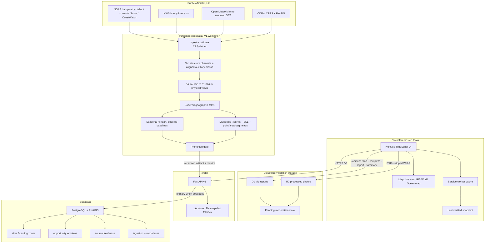
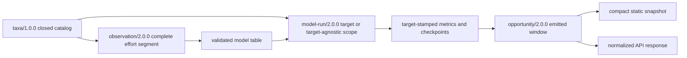
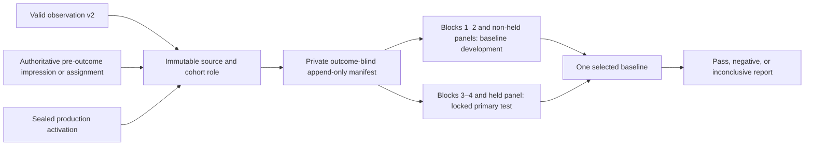
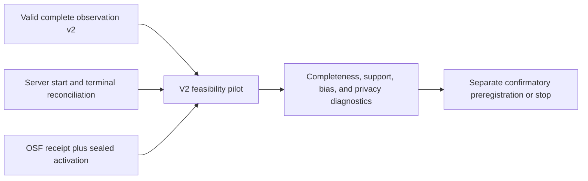

# CastingCompass architecture

## Runtime topology

## Species-contract boundary

The cross-language boundary is machine-readable and version locked:

`contracts/taxa.json` is the canonical catalog. Strictly compiled JSON schemas
freeze structural observation, run-metadata, and emitted-opportunity envelopes;
semantic validators remain mandatory for cross-field arithmetic, uniqueness,
environment, chronology, and content-identity rules. TypeScript and Python
helpers expose the same IDs and eligibility semantics. TypeScript owns reusable
record validators; Python applies fail-closed observation validation in its
ingestion and model-loading boundaries. One shared positive/adversarial fixture
corpus must pass with the same semantic result in both runtimes.
The contract currently permits California halibut as the only production model
target, unresolved fish as an observation-only bucket, and a test-only
synthetic target.

Each observation represents one complete targeted effort segment, not one
catch. It always includes the primary target row, so target misses with other
fish (`non_target_only`) stay distinct from trips with no fish (`no_fish`).
Catch-only exports, expanded estimates, generic targets, mixed targets, and
count/outcome mismatches stop at ingestion. Launch-v2 point observations are
limited to explicitly approved projected CRSs. Point-model eligibility
additionally requires exact temporal support, an exact match to the expected
model grid CRS, finite point coordinates, and a valid v2 contract.

Model metadata is either target-specific or explicitly target-agnostic for the
approved unlabeled terrain/probe workflows. Target and contract identity enter
the content-derived version seed and are repeated in downstream artifacts.
Public opportunity windows use a compact flat identity rather than duplicating
a nested object across every window. The identity distinguishes the current
`heuristic-configuration` from a future `trained-model`, and the static and API
paths validate the same target, versions, scoring version, and scoring hash.

The additive species migration preserves historical trip rows as
`legacy_unverified`; it does not infer confidence or reconstruct per-taxon
dispositions that were never collected. Those rows remain user-visible and
deletable but cannot enter modeling or validation. Production rollout requires
the migration plus aggregate pre/post audits before v2 collection is enabled.

## Validation-governance boundary

The observation contract answers whether a row is internally coherent. It does
not decide whether the row is admissible study evidence. Historical v1 modeled
the following confirmatory boundary, but it must not activate because its
external proof and independent-publication services do not exist:

`docs/VALIDATION-PROTOCOL.md` is the historical human contract;
`validation/protocols/california-halibut-site-window-v1.json` is the frozen
but inactive machine preregistration; and
`contracts/validation-split-manifest.schema.json` constrains the private
v1 activation/assignment chain. The design could support only an ordinal
California-halibut site × two-hour-window claim. Site rows remain site rows;
no exact coordinate is collected or inferred.

The current successor adds a smaller operational boundary:

`docs/VALIDATION-SUCCESSOR.md` and
`validation/protocols/california-halibut-collection-feasibility-v2.json` freeze
that pilot. It cannot compute candidate performance or promote a model, and its
rows are permanently excluded from a later confirmatory test. Local schema/test
completion does not activate production. V2 first needs server start/completion/
cancellation capture, deletion-linked participant grouping, append-only
corrections, encrypted snapshot/restore evidence, legal/privacy/data-steward
approval, an externally timestamped read-only registration, and a sealed
activation deployed before the first eligible row.

Historical v1's prospective frame assigned an immutable pre-outcome recruitment
source from three frozen IDs and included every eligible accepted row through
its fixed interval. Those rules are preserved only as inactive design history.
V2 retains the same source IDs for feasibility reporting but performs no pooled
candidate analysis.

## Score flow

1. `HabitatScore` comes from the promoted spatial model. In the current demo it is a labeled curated proxy, not a trained-model output.
2. `SeasonalityMultiplier` comes from monthly public catch and effort. The current demo uses a labeled provisional fixture pending a reproducible RecFIN export.
3. `DynamicModifier` uses fresh tide, wind, swell, current, and daylight inputs. It is bounded so conditions cannot erase the habitat signal. Modeled SST is currently displayed as unscored context while forecast-versus-station error is measured.
4. The combined values are ranked across the current candidate site/window set.
5. The user receives the percentile as `OpportunityScore`, plus components, confidence, explanation factors, model version, and source freshness.

## Freshness contract

Each external value records:

- source name;
- observation/check time;
- maximum age;
- `fresh`, `stale`, `missing`, or `excluded` status;
- whether it was used in the score;
- an exclusion reason when applicable.

Stale or missing values are not silently imputed as live observations. The API can return a partial result with the affected source removed, or a 503 when no verified snapshot exists.

## Resilience

- API reads prefer Postgres when configured and fall back to the packaged verified snapshot on database failure.
- The PWA uses the API when `NEXT_PUBLIC_API_URL` is set and the static snapshot otherwise.
- The service worker uses network-first caching for forecast JSON and navigation, retaining the last successful response for offline use.
- Trip APIs always bypass the service-worker response cache; offline forecast access never fabricates or queues a report submission.
- ArcGIS World Ocean base/reference tiles are external and may not be available offline; rankings and site details remain available. Basemap bathymetry is explanatory context, not navigation data and not the live habitat model.

## Security and privacy

- Forecast browsing remains anonymous. Trip reporting uses a random device key that is hashed before storage; no IP address, social identity, live GPS point, or raw reporter key is retained.
- Structured reports store only a curated access-zone identifier, trip time and effort, outcome, validation covariates, consent, and moderation state.
- Optional JPEG/PNG/WebP uploads are re-encoded to bounded WebP before private R2 storage, removing original metadata and filenames.
- Public summary responses expose aggregate totals only. Raw notes and photos have no public read endpoint, and pending reports do not automatically influence the score.
- Secrets live in Render/Supabase/hosting environment variables, not the repository.
- CORS is explicit.
- No private catch coordinates enter the study export. Accounts exist, but raw
  account IDs and resettable reporter/device identifiers are excluded from v2;
  only a privacy-safe deletion-linked participant group is permitted.
- Authentication, report deletion/editing, moderation tooling, Stripe, alerts, and personal logs remain future work.
