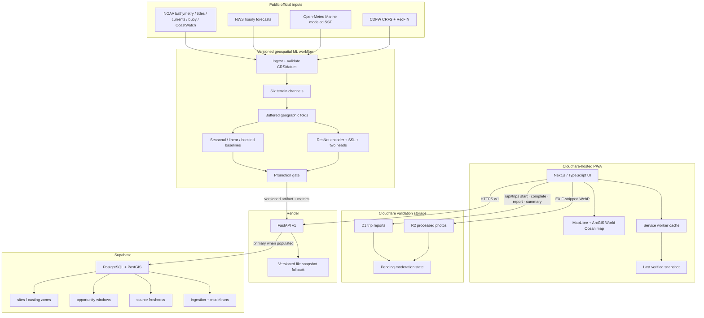

# ContourCast architecture

## Runtime topology

## Score flow

1. `HabitatScore` comes from the promoted spatial model. In the current demo it is a labeled curated proxy, not a trained-model output.
2. `SeasonalityMultiplier` comes from monthly public catch and effort. The current demo uses a labeled provisional fixture pending a reproducible RecFIN export.
3. `DynamicModifier` uses fresh tide, wind, swell, current, and daylight inputs. It is bounded so conditions cannot erase the habitat signal. Modeled SST is currently displayed as unscored context while forecast-versus-station error is measured.
4. The combined values are ranked across the current candidate site/window set.
5. The user receives the percentile as `OpportunityScore`, plus components, confidence, explanation factors, model version, and source freshness.

## Freshness contract

Each external value records:

- source name;
- observation/check time;
- maximum age;
- `fresh`, `stale`, `missing`, or `excluded` status;
- whether it was used in the score;
- an exclusion reason when applicable.

Stale or missing values are not silently imputed as live observations. The API can return a partial result with the affected source removed, or a 503 when no verified snapshot exists.

## Resilience

- API reads prefer Postgres when configured and fall back to the packaged verified snapshot on database failure.
- The PWA uses the API when `NEXT_PUBLIC_API_URL` is set and the static snapshot otherwise.
- The service worker uses network-first caching for forecast JSON and navigation, retaining the last successful response for offline use.
- Trip APIs always bypass the service-worker response cache; offline forecast access never fabricates or queues a report submission.
- ArcGIS World Ocean base/reference tiles are external and may not be available offline; rankings and site details remain available. Basemap bathymetry is explanatory context, not navigation data and not the live habitat model.

## Security and privacy

- Forecast browsing remains anonymous. Trip reporting uses a random device key that is hashed before storage; no IP address, social identity, live GPS point, or raw reporter key is retained.
- Structured reports store only a curated access-zone identifier, trip time and effort, outcome, validation covariates, consent, and moderation state.
- Optional JPEG/PNG/WebP uploads are re-encoded to bounded WebP before private R2 storage, removing original metadata and filenames.
- Public summary responses expose aggregate totals only. Raw notes and photos have no public read endpoint, and pending reports do not automatically influence the score.
- Secrets live in Render/Supabase/hosting environment variables, not the repository.
- CORS is explicit.
- No private catch coordinates or user accounts exist in v1.
- Authentication, report deletion/editing, moderation tooling, Stripe, alerts, and personal logs remain future work.
